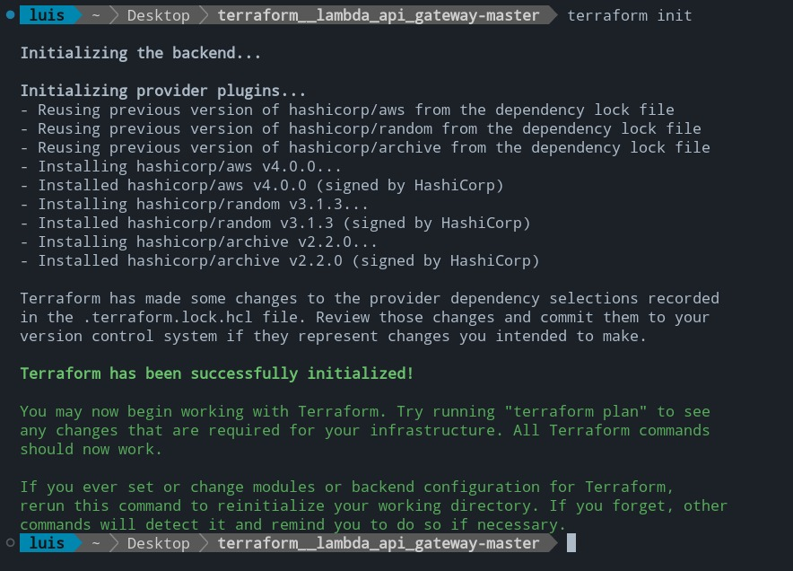
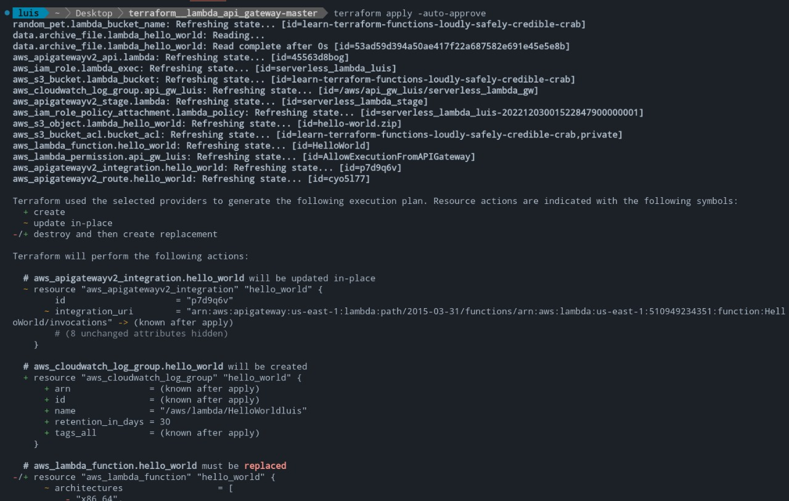
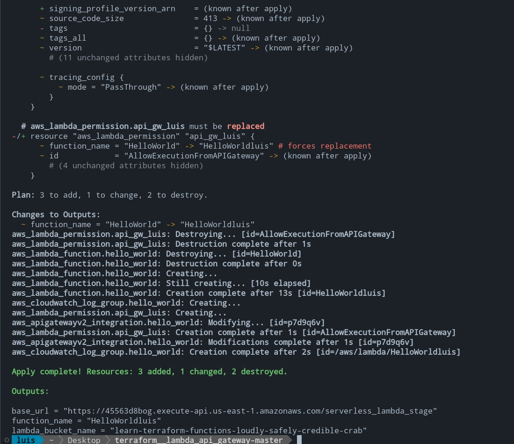
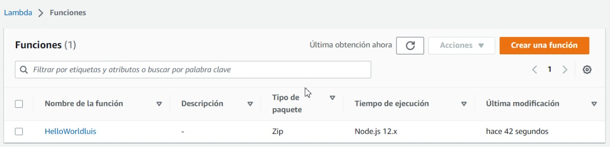
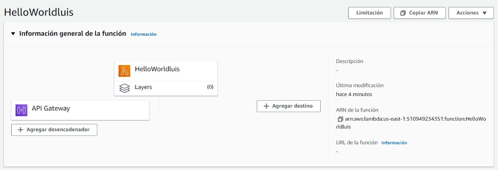
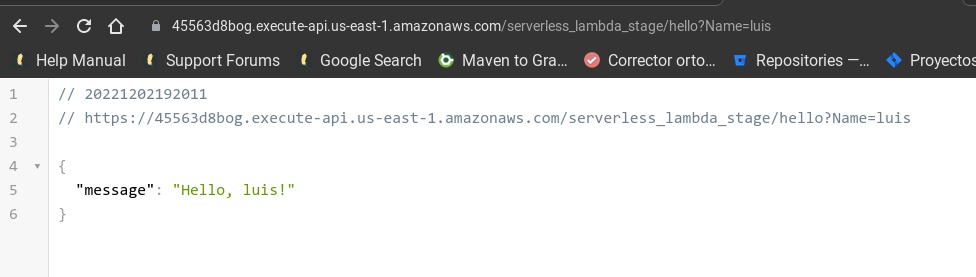
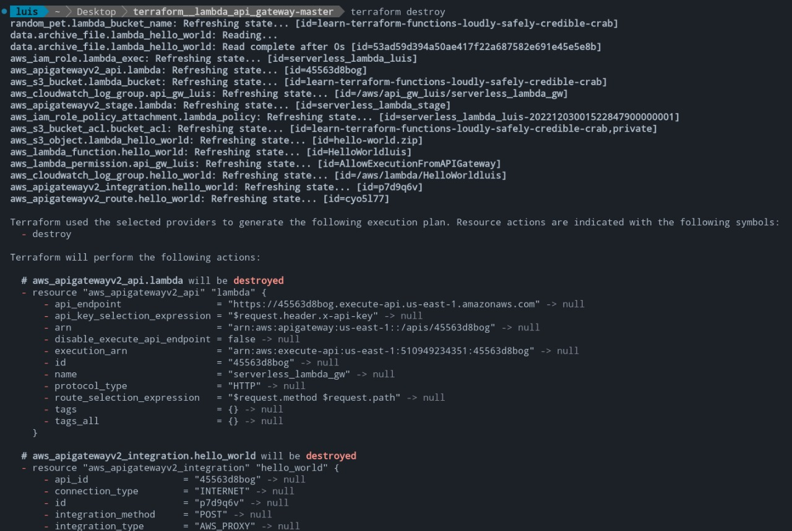

# Create lamda api gateway with terraform

## What is Terraform?

<p>
HashiCorp Terraform is an infrastructure as code tool that lets you define both cloud and on-prem resources in human-readable configuration files that you can version, reuse, and share. You can then use a consistent workflow to provision and manage all of your infrastructure throughout its lifecycle. Terraform can manage low-level components like compute, storage, and networking resources, as well as high-level components like DNS entries and SaaS features.
</p>


## Project structure

```
.
├── hello-world
│   └── hello.js
├── hello-world.zip
├── main.tf
├── outputs.tf
├── README.md
├── terraform.tfstate
└── terraform.tfstate.backup
```

## Commands to create an instance

```
terraform init
```



```
terraform apply -auto-approve
```







## Consume the hello world endpoint 1



## Consume the hello world endpoint 2


```
terraform destroy
```


